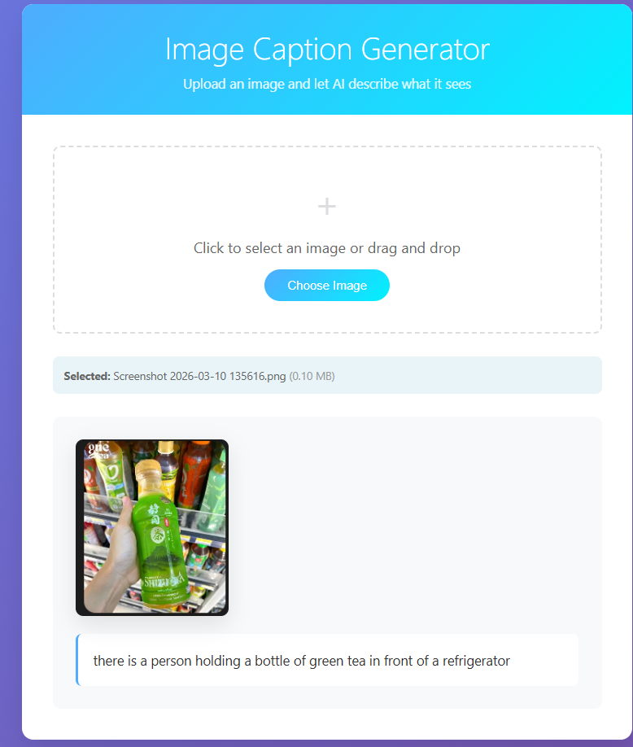
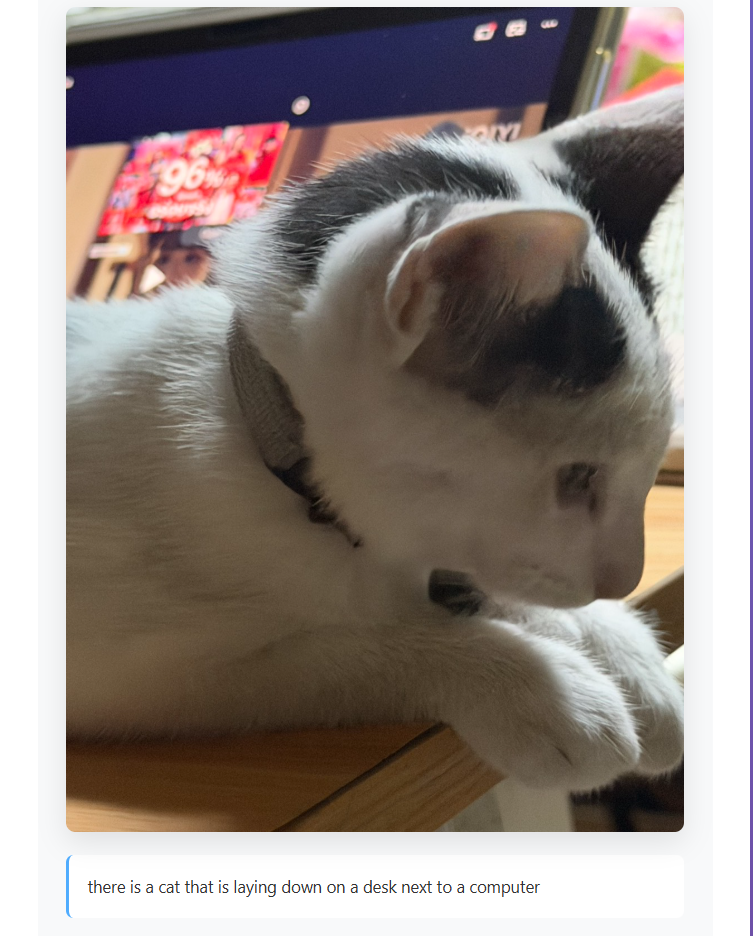
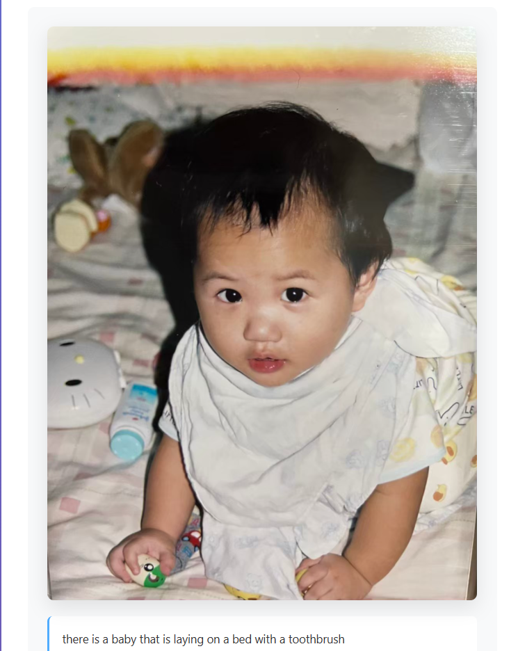

# Activity 2.5 — Web-Based Personal Gallery + Image Captioning

This project implements the assignment requirement from the slides:

1. Create a web-based personal gallery where users can create albums and upload multiple images.
2. Enhance browsing with an ML component by calling Hugging Face model `Salesforce/blip-image-captioning-base`.

## Features

- Create multiple albums
- Upload multiple images per album
- Auto-generate captions after upload (optional checkbox)
- Generate/refresh caption for each image individually
- Local JSON storage for captions per album (`uploads/<album>/captions.json`)

## Tech Stack

- Python 3
- Flask
- Hugging Face Inference API (`Salesforce/blip-image-captioning-base`)

## Setup

1. Install dependencies:

   ```
   pip install -r requirements.txt
   ```

2. Configure environment variables in `.env`:

   - `HF_API_TOKEN` = your Hugging Face token
   - `FLASK_SECRET_KEY` = any secure random string
   - `HF_CUSTOM_INFERENCE_URL` (optional) = your dedicated Hugging Face Inference Endpoint URL for BLIP

3. Run the app:

   ```
   python app3.py
   ```

4. Open:

   - `http://127.0.0.1:5000`

## How to use

1. Create an album from the home page.
2. Enter the album and upload multiple images.
3. Keep **Generate captions after upload** checked to call the BLIP model automatically.
4. If needed, click **Generate/Refresh caption** on any image card.

## Submission checklist (for GitHub)

- [x] Source code uploaded
- [x] ML integration with Hugging Face BLIP endpoint
- [ ] Add your own prediction evidence in this README
   - Include sample image names and generated captions
   - Optionally include screenshots

## Sample images

### Green bottle



### Cat on computer



### Baby



## Notes

- If `HF_API_TOKEN` is missing or invalid, uploads still work, but caption generation may fail or be rate-limited.
- If you get `404` from `router.huggingface.co` for `Salesforce/blip-image-captioning-base`, the model is currently unavailable on serverless Inference Providers for your account/region. In that case, deploy a dedicated Inference Endpoint and set `HF_CUSTOM_INFERENCE_URL`.
- Max upload size is 16MB per file.
